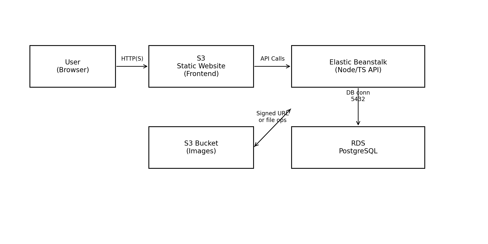

# Infrastructure / Architecture Diagram

## Components
- **Frontend**: Hosted on AWS S3 (static website)
- **Backend API**: Hosted on AWS Elastic Beanstalk
- **Database**: PostgreSQL on AWS RDS

## Communication
- Browser → S3 (HTTP)
- Frontend → API on Elastic Beanstalk (HTTP)
- API → RDS PostgreSQL (TCP 5432)
