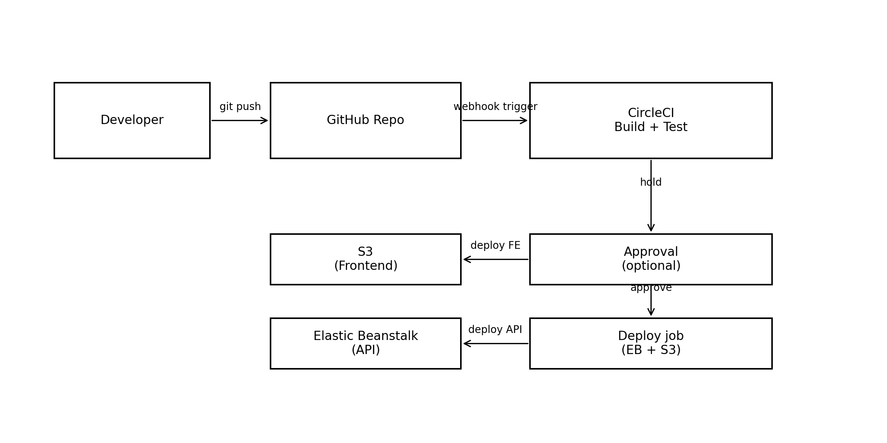

# Pipeline Diagram

## Flow (High level)
1. Developer pushes code to GitHub (`main` branch)
2. CircleCI triggers workflow
3. Build: install → lint → build (frontend & backend)
4. Deploy:
    - `eb setenv` to inject environment variables into Elastic Beanstalk
    - `eb deploy` to deploy backend
    - `aws s3 sync` to deploy frontend to S3
